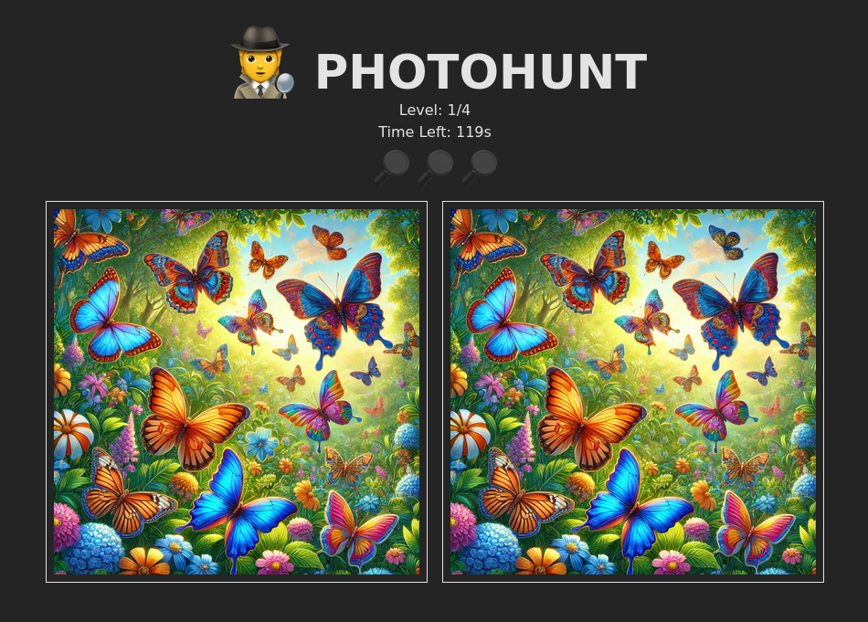

# PhotoHunt

PhotoHunt is a fun and engaging game where players find differences between two similar images. Test your observation skills and enjoy hours of entertainment!

- Multiple levels with increasing difficulty
- Timer to challenge your speed

## Screenshots



## Prerequisites

Make sure you have the following installed on your system:
- [Node.js](https://nodejs.org/) (Recommended: latest LTS version)
- [npm](https://www.npmjs.com/) (Comes with Node.js) or [Yarn](https://yarnpkg.com/) / [pnpm](https://pnpm.io/)

## Getting Started

### 1. Clone the repository

```sh
git clone https://github.com/K1TTYBLACK/photohunt.git
cd photohunt
```

### 2. Install dependencies

Using npm:
```sh
npm install @tailwindcss/vite react react-dom
```

### 3. Start the development server

Using npm:
```sh
npm run dev
```

### 4. Open in Browser

Once the server starts, open your browser and go to:
```
http://localhost:5173
```
